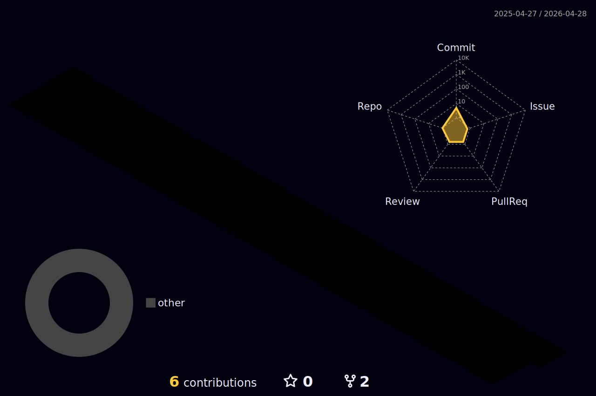

  
  
  

## 🌌 Commander's Log

我是一名具備經濟學與零售銀行背景的前端開發者，致力於將嚴謹的邏輯思維帶入 Web 開發的世界。

- 🔭 **目前專注於**：開發結合 AI 技術的 Anki 語言學習應用。
- 💻 **主要技術棧**：React.js, Next.js, 專注於流暢的前端體驗。
- 🌍 **即將啟程**：今年五月準備前往澳洲墨爾本展開打工度假！
- 🎮 **休閒充電**：爬塔（Slay the Spire 2）、看情境喜劇，或是沉浸在 Ted Chiang 的科幻小說中。
- 📫 **如何聯絡我**：janetony908@gmail.com

---

## 🛠️ Tech Stack 裝備庫

  
  
  
  
  

## 🧊 3D Contribution City

